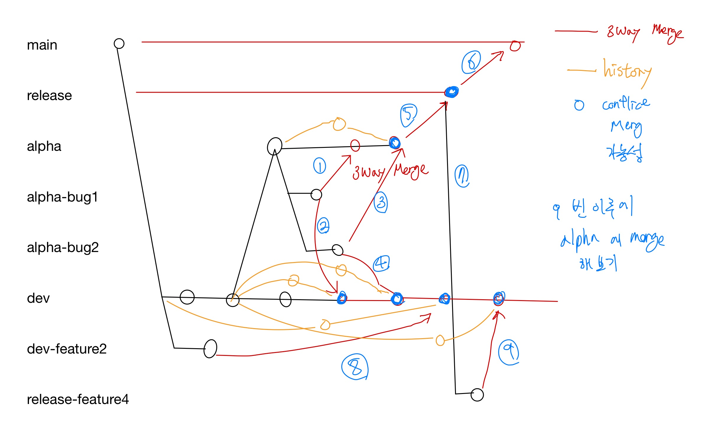
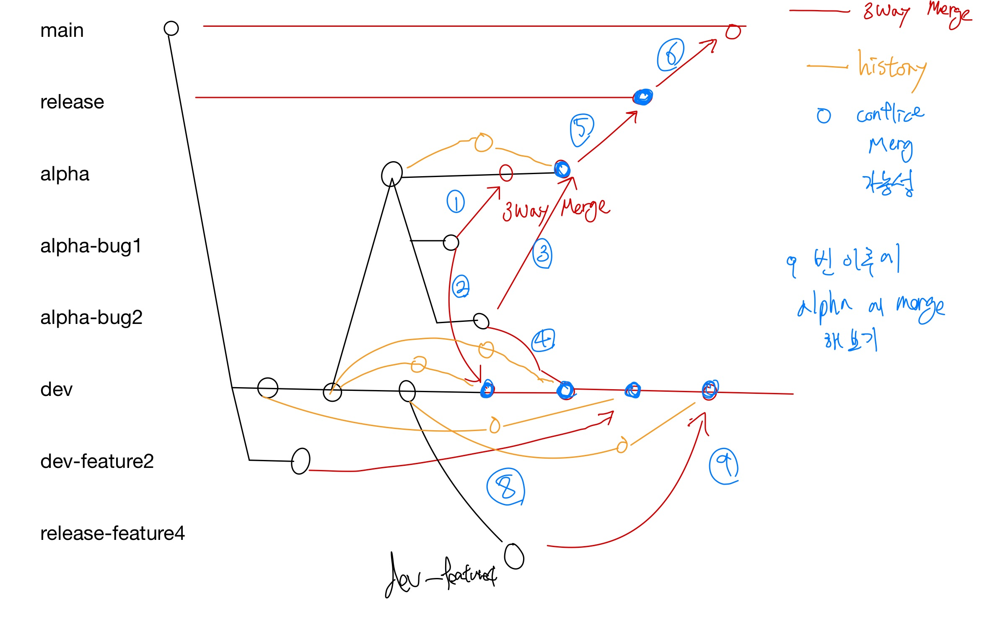

# gitflow_test

깃플로우 Merge 전략

## STEP1. AS-IS release 에서 Feature 분기

feature 분기 및 3-way Merge 를 사용

문제점 - master에서 분기된 feature가 각 alpha, dev, release에 병합되는 문제 발생


1. ***alpha-bug1*** 를  ***alpha*** 로 병합 (3way Merge)
- 처음에는 conflict 없이 Fast-Forward 로 잘 병합됨
```
git checkout alpha
git merge alpha-bug1

//아래의 코드는 앞으로 생략
git push origin alpha
```
2. ***alpha-bug1*** 를 ***dev*** 로 병합 (3way Merge)
- 만약 같은 파일을 수정중이라면 Conflict 발생
- 직접 코드 수정 후 커밋 진행 
```
git checkout dev
git merge alpha-bug1

//confict 해결해야함

git add . 
git add 경로

git commit
//:wq
```

3. ***alpha-bug2*** 를 ***alpha*** 로 병합 (3way Merge)

- 동일한 파일 수정 시 conflict가 일어나고 충돌 부분을 수정해야함
- 해결 후 커밋 시 Merge Commit 생성
```
git checkout alpha
git merge alpha-bug2

//confict 해결해야함

git add . 
git add 경로

git commit
//:wq
```

4. ***alpha-bug2*** 를 ***dev*** 로 병합 (3way Merge)

- 동일한 파일 수정 시 conflict가 일어나고 충돌 부분을 수정해야함
- 해결 후 커밋 시 Merge Commit 생성
```
git checkout dev
git merge alpha-bug2

//confict 해결해야함

git add . 
git add 경로

git commit
//:wq
```

5. ***alpha*** ***release*** 병합(배포)
```
git checkout alpha
git checkout -b release

//만약 release가 있었다면
git checkout release
git merge alpha 이후 conflict 해결

tip
git checkout --theirs 경로
git checkout --ours 경로
```

6. ***release*** ***main*** 병합(배포)
- 마찬가지로 같은 파일 수정 시 conflict 발생
```
git checkout main

git merge release
```

7. ***release*** 에서 ***release-feature4*** 분기하여 작업
```
git checkout release

git checkout -b release-feature4

// 코드 작성, 같은 파일 수정도 진행하세요
git add .
git commit -m "release-feature4 릴리즈에서 분기한 커밋"
```

8. ***dev-feature2*** 에서 ***dev*** 병합
- 과거 마스터 혹은 release 에서 분기한 개발 작업 브랜치
```
git checkout dev

git merge dev-feature2

//confict 해결해야함

git add . 
git add 경로

git commit
//:wq
```


9. ***release-feature4*** 에서 ***dev*** 병합
- 7번에서 작업한 브랜치를 dev로 병합
```
git checkout dev

git merge release-feature4

//confict 해결해야함

git add . 
git add 경로

git commit
//:wq
```

### 확인 할 점
- 각 브랜치에서 git log --graph 확인해서 history 확인하기
- dev branch 의 log와 STEP2의 dev branch 의 log 비교
- 이 Merge 전략으로는 각 브랜치 병합 시 무조건 conflict가 일어남

## STEP2. AS-IS dev 에서 Feature 분기
- 6번까지는 STEP 1번과 동일함



1. ***alpha-bug1*** 를  ***alpha*** 로 병합 (3way Merge)
- 처음에는 conflict 없이 Fast-Forward 로 잘 병합됨
```
git checkout alpha
git merge alpha-bug1

//아래의 코드는 앞으로 생략
git push origin alpha
```
2. ***alpha-bug1*** 를 ***dev*** 로 병합 (3way Merge)
- 만약 같은 파일을 수정중이라면 Conflict 발생
- 직접 코드 수정 후 커밋 진행
```
git checkout dev
git merge alpha-bug1

//confict 해결해야함

git add . 
git add 경로

git commit
//:wq
```

3. ***alpha-bug2*** 를 ***alpha*** 로 병합 (3way Merge)

- 동일한 파일 수정 시 conflict가 일어나고 충돌 부분을 수정해야함
- 해결 후 커밋 시 Merge Commit 생성
```
git checkout alpha
git merge alpha-bug2

//confict 해결해야함

git add . 
git add 경로

git commit
//:wq
```

4. ***alpha-bug2*** 를 ***dev*** 로 병합 (3way Merge)

- 동일한 파일 수정 시 conflict가 일어나고 충돌 부분을 수정해야함
- 해결 후 커밋 시 Merge Commit 생성
```
git checkout dev
git merge alpha-bug2

//confict 해결해야함

git add . 
git add 경로

git commit
//:wq
```

5. ***alpha*** ***release*** 병합(배포)
```
git checkout alpha
git checkout -b release

//만약 release가 있었다면
git checkout release
git merge alpha   // 이후 conflict 해결

tip
git checkout --theirs 경로
git checkout --ours 경로
```

6. ***release*** ***main*** 병합(배포)
- 마찬가지로 같은 파일 수정 시 conflict 발생
```
git checkout main

git merge release
```

---

7. ***dev-feature2*** 에서 ***dev*** 병합
- 과거 마스터 혹은 release 에서 분기한 개발 작업 브랜치
```
git checkout dev

git merge dev-feature2

//confict 해결해야함

git add . 
git add 경로

git commit
//:wq
```

8. ***dev-feature4*** 에서 ***dev*** 병합
- 7번에서 작업한 브랜치를 dev로 병합
```
git checkout dev

git merge release-feature4

//confict 해결해야함

git add . 
git add 경로

git commit
//:wq
```

### 확인 할 점
- STEP1과 dev branch 비교하기
- history가 약간 다르긴 하지만 STEP1과 큰 차이는 없음
- release로 feature를 분기하여 작업하나 dev에서 feature를 분기하여 작업하나 dev에 병합되는 순간 무결성이 깨짐

#STEP3. TO-DO

